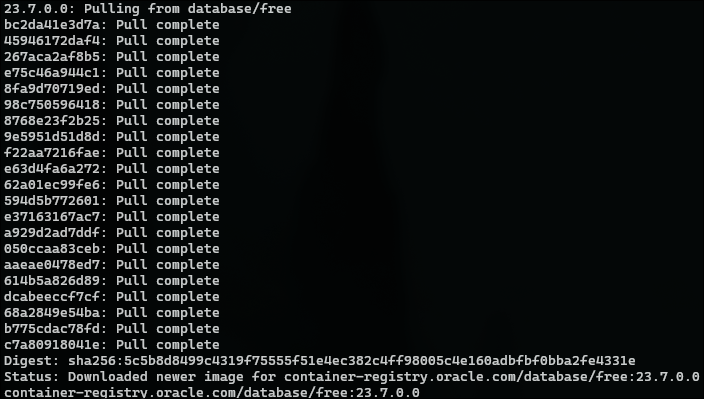
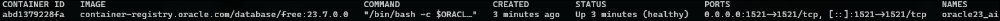
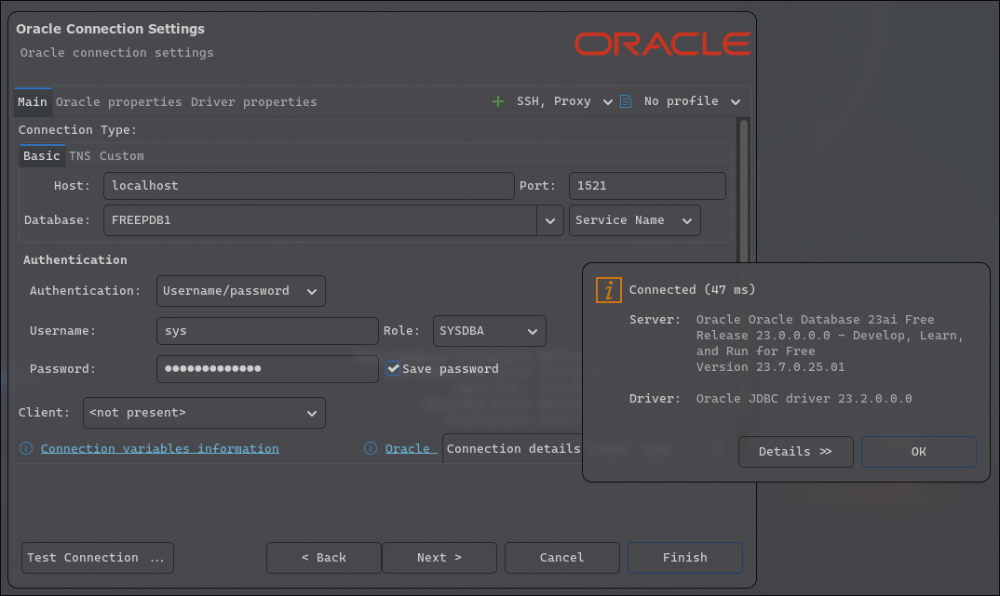
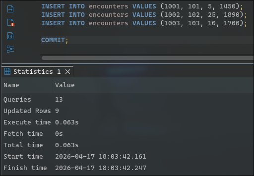
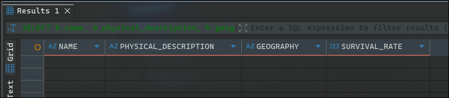
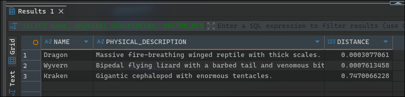
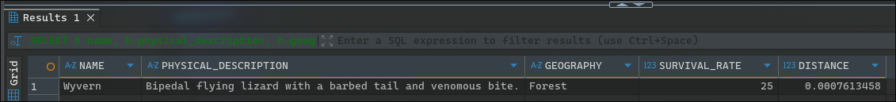
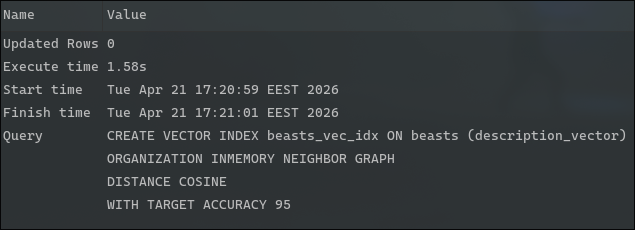
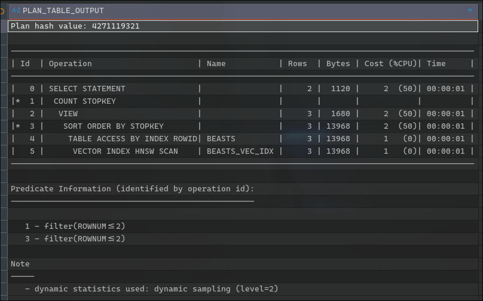

# Oracle AI Vector Search vs. căutare tradițională

Proiectul de față prezintă o demonstrație practică ce compară căutarea tradițională pe bază de cuvinte cheie cu cea semantică oferită de **Oracle AI Vector Search**, în cadrul bazelor de date **Oracle 23ai**.

## Arhitectura soluției
Soluția rulează pe o singură instanță de Oracle 23ai instalată într-un container **Docker**.

Modelul de date constă într-o schemă cu trei tabele referitoare la **creaturi mitice**:
- `habitats`: date relaționale despre climă și geografie
- `beasts`: tabelul de bază, ce descrie creaturile; FK către `habitats`
- `encounters`: statistici cu privire la întâlnirile cu creaturile; FK către `beasts`

Tabelul principal `beasts` va găzdui o coloană de tip `VECTOR`, care conține reprezentarea matematică a descrierii creaturii în text.

Deoarece vectorii sunt stocați ca tipuri native de date pe lângă modelul relațional obișnuit, administratorii pot executa interogări complexe care filtrează date din mai multe tabele și, concomitent, ordonează rezultatele în funcție de similaritatea semantică.

## Mitul performanței 

Într-o bază de date mică, o căutare clasică de tip `LIKE` va fi mereu extrem de rapidă. Totuși, performanța adevărată în lucrul cu date nestructurate nu se măsoară doar în timpul de răspuns, ci și în calitatea și relevanța rezultatelor. Degeaba o interogare se execută foarte rapid dacă, în final, va întoarce 0 rezultate utile (de ex, atunci când lipsește un cuvânt cheie). Vector Search reduce timpul pierdut de utilizator pentru a găsi informația corectă.

## Arhitectura RAG (Retrieval-Augmented Generation)

Această funcționalitate reprezintă fundația aplicațiilor AI sigure și moderne. LLM-urile arhicunoscute precum ChatGPT sau Gemini, halucinează și nu au acces la date private. Prin Oracle AI Vector Search, se poate extrage rapid contextul relevant din baza de date (Retrieval) și se poate trimite către LLM pentru a formula un răspuns sigur, pe baza propriilor informații.

## Configurație software și hardware

Cerințe software:
- Docker Engine instalat pe SO
- Imaginea `container-registry.oracle.com/database/free:latest` aferentă Oracle Database 23ai Free
- Cel puțin un tool de interogare: clienți SQL standard (SQL Developer, DBeaver) sau în linia de comandă (`sqlplus`)

Cerințe hardware:
- **Memorie:** cel puțin 2GB alocați la Docker (4GB recomandați)
- **Spațiu de stocare:** 10GB disponibli
- **Sistem de operare:** orice SO capabil să ruleze containere Docker (Windows, macOS, Linux)

## Pași de instalare
### Instalarea și pornirea container-ului
În primul rând, vom descărca imaginea Docker a bazei de date.

```bash
docker pull container-registry.oracle.com/database/free:23.7.0.0
```



Vom rula, apoi, comanda următoare într-un terminal și vom porni baza de date:

```bash
docker run -d --name oracle23_ai \
  -p 1521:1521 \
  -e ORACLE_PWD=SuperSysPass1 \
  container-registry.oracle.com/database/free:23.7.0.0
```



### Inițializarea bazei de date
Ne vom conecta la baza de date din clientul ales, folosind credențialele anterioare.



Apoi, vom rula script-ul aferent creării tabelelor și inserării datelor.



## Scenarii de utilizare
### Scenariul I
Primul scenariu constă într-o căutare tradițională: toate creaturile mitice asemănătoare dragonilor, cu rata de supraviețuire de peste 10%.



Deși intrarea de tip `Wyvern` se potrivește intenției noastre de căutare, descrierea sa nu conține, în mod explicit, cuvântul cheie `dragon`, astfel că interogarea va întoarce 0 rânduri.

### Scenariul II
În cel de-al doilea scenariu, vom căuta creaturile dorite folosind funcția `VECTOR_DISTANCE`.



Se poate observa cum, în acest caz, baza de date întoarce atât intrări de tip `Dragon`, cât și cele de tip `Wyvern`, datorită similarității între descrierile text ale celor două creaturi.

Metrica aleasă `COSINE` este una standard pentru conținut text, ce evaluează unghiul dintre cei doi vectori. Cât despre cel de-al doilea termen al comparației, acesta conține date *mocked*, întrucât pentru date reale ar fi fost nevoie de un model de *embedding* care face conversia din text în vectori numerici.

De asemenea, am folosim vectori cu 3 dimensiuni pentru a fi lizibili și vizualizabili pe ecran (ex: [0.88, 0.12, 0.1]). În scenarii reale de producție, textul este trecut printr-un model ce are vectori cu 384, 768 sau chiar 1536 de dimensiuni.

Acest scenariu acoperă partea de Retrieval a RAG, cea prin care informația este găsită. Într-o aplicație RAG, informația brută nu ajunge la utilizator, ci transmisă, mai întăi, către un LLM ce va genera un text specific rezultatului.

### Scenariul III
În cel de-al treilea scenariu, vom efectua atât o filtrare „tradițională”, cât și una pe bază de vectori, pentru a extrage rezultatul dorit (creatură similară unui dragon, cu rata de subraviețuire peste 10%).



Query-ul aplică prima dată filtrele relaționale precise pe tabelele `habitats` și `encounters`, apoi ordonează rezultatele rămase în funcție de cât de bine se potrivește descrierea creaturii cu intenția noastră de căutare.

## Scalabilitate

Pentru a asigura scalabilitatea pe milioane de înregistrări, Oracle 23ai permite crearea unor indecși specializați. Astfel, am adăugat un index de tip HNSW (Hierarchical Navigable Small World) pentru performanță maximă.



*Notă: crearea de indecși de tip vector necesită alocarea/mărirea memoriei aferente vectorilor în baza de date*

Fără index, baza de date ar fi trebuit să facă distanța Cosine pentru absolut fiecare creatură din tabel (Exact Nearest Neighbor) – o performanța scăzută la un număr mare de date. Datorită indexului HNSW, Oracle face un Approximate Nearest Neighbor (ANN). Navighează prin indexul vectorial și aduce rezultatul instant, fără să citească toate datele.



---

Albei Liviu, Codreanu Radu, Florian Luca-Paul

FMI, BDTS, Anul II, 2026
